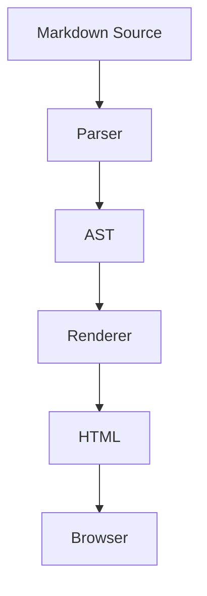
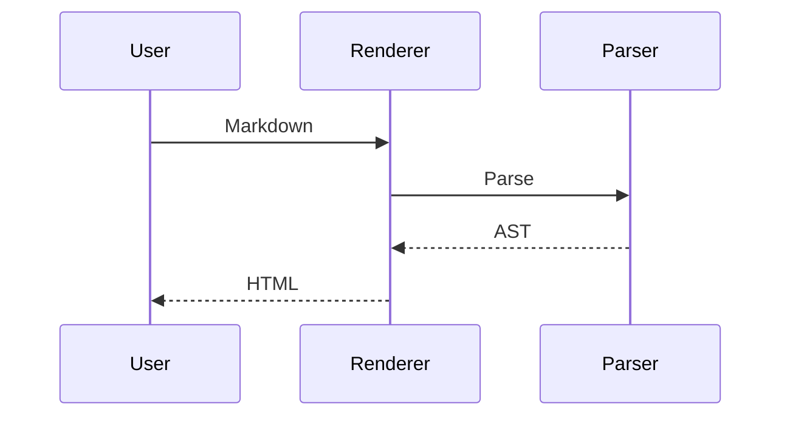

# Markdown Renderer 综合测试

> 这是一份用于测试 Markdown 渲染器兼容性的文档，包含基础 Markdown、GFM、数学公式、代码高亮、HTML、Mermaid 等内容。

---

# 1. 标题测试

# 一级标题 H1

## 二级标题 H2

### 三级标题 H3

#### 四级标题 H4

##### 五级标题 H5

###### 六级标题 H6

---

## 2. 文本格式

普通文本。

**粗体文本**

__另一种粗体__

*斜体文本*

_另一种斜体_

***粗斜体文本***

___另一种粗斜体___

~~删除线文本~~

`行内代码`

这是一个包含 **粗体**、*斜体*、~~删除线~~、`inline code` 的混合段落。

测试特殊字符：

\*不会变成斜体\*

\# 不会变成标题

反斜杠：`\`

HTML 实体：

- 小于号：&lt;
- 大于号：&gt;
- 与号：&amp;
- 版权符号：&copy;

---

## 3. 段落与换行

这是第一段文本。这一段比较长，用来测试普通段落的排版效果。

这是第二段文本。

这一行后面有两个空格，用来测试 Markdown 强制换行。  
这一行应该显示在下一行。

---

## 4. 引用 Blockquote

> 这是一级引用。

> 这是一个多行引用。
>
> 第二段仍然属于引用。

> 一级引用
>
> > 二级嵌套引用
>
> >> 三级嵌套引用

> ### 引用中的标题
>
> - 引用中的列表
> - 第二项
>
> **引用中的粗体**
>
> 数学公式：$E = mc^2$

---

## 5. 无序列表

- Apple
- Banana
- Orange

* 使用星号
* 第二项
* 第三项

+ 使用加号
+ 第二项
+ 第三项

嵌套列表：

- 前端
  - HTML
  - CSS
    - Flexbox
    - Grid
  - JavaScript
    - React
    - Vue
- 后端
  - Node.js
  - Go
  - Rust

---

## 6. 有序列表

1. 第一步
2. 第二步
3. 第三步

嵌套：

1. 安装依赖
   1. 安装 Node.js
   2. 安装 pnpm
2. 启动项目
   1. `pnpm install`
   2. `pnpm dev`
3. 打开浏览器

测试自定义序号：

10. 第十项
11. 第十一项
12. 第十二项

---

## 7. Task List

- [x] 支持标题
- [x] 支持列表
- [x] 支持代码块
- [ ] 支持数学公式
- [ ] 支持 Mermaid
- [ ] 支持脚注

嵌套任务：

- [ ] Markdown Renderer
  - [x] Parser
  - [x] AST
  - [ ] Renderer
  - [ ] Syntax Highlight

---

## 8. 链接

普通链接：

[OpenAI](https://openai.com)

带标题：

[MDN Web Docs](https://developer.mozilla.org "MDN")

自动链接：

<https://example.com>

邮箱：

<hello@example.com>

引用式链接：

这是一个 [示例网站][example]。

[example]: https://example.com "Example"

---

## 9. 图片

普通图片：


带标题的图片：


图片链接：

[](https://example.com)

---

## 10. 分割线

---

***

___

---

## 11. 行内代码

JavaScript 中可以使用 `console.log("Hello World")` 输出内容。

React Hook：

`const [count, setCount] = useState(0);`

包含特殊字符：

`<div class="foo">Hello</div>`

---

## 12. 代码块

### JavaScript

```javascript
function fibonacci(n) {
  if (n <= 1) return n;

  return fibonacci(n - 1) + fibonacci(n - 2);
}

console.log(fibonacci(10));
```

### TypeScript

```typescript
interface User {
  id: number;
  name: string;
  email?: string;
}

const user: User = {
  id: 1,
  name: "Alice",
};

function hello<T extends User>(user: T): string {
  return `Hello ${user.name}`;
}
```

### React / JSX

```jsx
import { useState } from "react";

export default function Counter() {
  const [count, setCount] = useState(0);

  return (
    <button onClick={() => setCount(count + 1)}>
      Count: {count}
    </button>
  );
}
```

### HTML

```html
<!DOCTYPE html>
<html lang="zh-CN">
<head>
  <meta charset="UTF-8" />
  <title>Hello Markdown</title>
</head>

<body>
  <h1>Hello World</h1>
</body>
</html>
```

### CSS

```css
.container {
  display: grid;
  grid-template-columns: repeat(3, 1fr);
  gap: 16px;
}

.card:hover {
  transform: translateY(-2px);
}
```

### JSON

```json
{
  "name": "markdown-renderer",
  "version": "1.0.0",
  "features": [
    "markdown",
    "latex",
    "mermaid"
  ],
  "enabled": true
}
```

### Shell

```bash
pnpm install
pnpm dev

echo "Hello Markdown"
```

### Python

```python
def fibonacci(n: int) -> int:
    if n <= 1:
        return n

    return fibonacci(n - 1) + fibonacci(n - 2)


print(fibonacci(10))
```

### 无语言代码块

```
Hello World
中文测试
特殊字符 !@#$%^&*()
```

---

# 13. 表格

## 基础表格

| 姓名    | 年龄 | 职业               |
| ------- | ---- | ------------------ |
| Alice   | 24   | Frontend Developer |
| Bob     | 30   | Backend Developer  |
| Charlie | 28   | Designer           |

## 对齐测试

| 左对齐 |  居中  | 右对齐 |
| :----- | :----: | -----: |
| Left   | Center |  Right |
| 123    |  456   |    789 |
| abc    |  def   |    ghi |

## 表格中的 Markdown

| 类型     | 示例                         | 状态 |
| -------- | ---------------------------- | ---- |
| 粗体     | **Hello**                    | ✅    |
| 斜体     | *Hello*                      | ✅    |
| 删除线   | ~~Hello~~                    | ✅    |
| 代码     | `npm install`                | ✅    |
| 数学公式 | $x^2 + y^2$                  | 🤔    |
| 链接     | [OpenAI](https://openai.com) | ✅    |

---

# 14. 数学公式测试

下面部分用于测试 **KaTeX / MathJax / LaTeX**。

## 行内公式

这是一个简单的行内公式：

$E = mc^2$

勾股定理：

$a^2 + b^2 = c^2$

圆的面积：

$S = \pi r^2$

Euler 恒等式：

$e^{i\pi} + 1 = 0$

---

## 块级公式

$$
E = mc^2
$$

$$
a^2 + b^2 = c^2
$$

---

## 分数

$$
\frac{1}{2}
$$

复杂分数：

$$
\frac{x^2 + 2x + 1}{x + 1}
$$

---

## 上标与下标

$$
x_1 + x_2 + x_3
$$

$$
a^{n+1} = a^n \cdot a
$$

$$
x_i^{(k)}
$$

---

## 根号

$$
\sqrt{x}
$$

$$
\sqrt{x^2 + y^2}
$$

$$
\sqrt[n]{x}
$$

---

## 求和

$$
\sum_{i=1}^{n} i
=
\frac{n(n+1)}{2}
$$

无限级数：

$$
\sum_{n=0}^{\infty} \frac{1}{2^n} = 2
$$

---

## 连乘

$$
\prod_{i=1}^{n} i = n!
$$

---

## 极限

$$
\lim_{x \to 0} \frac{\sin x}{x} = 1
$$

$$
\lim_{n \to \infty}
\left(
1 + \frac{1}{n}
\right)^n
=
e
$$

---

## 微积分

导数：

$$
\frac{d}{dx}x^n = nx^{n-1}
$$

积分：

$$
\int x^2 \, dx
=
\frac{x^3}{3} + C
$$

定积分：

$$
\int_0^1 x^2 \, dx
=
\frac{1}{3}
$$

多重积分：

$$
\iiint_V f(x,y,z)\,dV
$$

---

## 偏导数

$$
\frac{\partial f}{\partial x}
$$

$$
\frac{\partial^2 f}
{\partial x \partial y}
$$

---

## 矩阵

$$
A =
\begin{bmatrix}
1 & 2 \\
3 & 4
\end{bmatrix}
$$

矩阵乘法：

$$
\begin{bmatrix}
a & b \\
c & d
\end{bmatrix}
\begin{bmatrix}
x \\
y
\end{bmatrix}
=
\begin{bmatrix}
ax + by \\
cx + dy
\end{bmatrix}
$$

---

## 行列式

$$
\det(A)
=
\begin{vmatrix}
a & b \\
c & d
\end{vmatrix}
=
ad-bc
$$

---

## 方程组

$$
\begin{cases}
x + y = 10 \\
2x - y = 5
\end{cases}
$$

---

## 二次方程求根公式

$$
x =
\frac{
-b \pm \sqrt{b^2 - 4ac}
}{
2a
}
$$

---

## 三角函数

$$
\sin^2\theta + \cos^2\theta = 1
$$

$$
\tan\theta
=
\frac{\sin\theta}{\cos\theta}
$$

---

## 希腊字母

$$
\alpha,\beta,\gamma,\delta,\epsilon,\theta,\lambda,\mu,\pi,\rho,\sigma,\phi,\omega
$$

$$
\Gamma,\Delta,\Theta,\Lambda,\Pi,\Sigma,\Phi,\Omega
$$

---

## 向量

$$
\vec{v}
=
\begin{bmatrix}
x \\
y \\
z
\end{bmatrix}
$$

点积：

$$
\vec{a}\cdot\vec{b}
=
|\vec{a}||\vec{b}|\cos\theta
$$

---

## 集合

$$
A \cup B
$$

$$
A \cap B
$$

$$
x \in A
$$

$$
A \subseteq B
$$

$$
\mathbb{N}
\subset
\mathbb{Z}
\subset
\mathbb{Q}
\subset
\mathbb{R}
\subset
\mathbb{C}
$$

---

## 逻辑表达式

$$
P \land Q
$$

$$
P \lor Q
$$

$$
\neg P
$$

$$
P \Rightarrow Q
$$

$$
P \Leftrightarrow Q
$$

$$
\forall x \in \mathbb{R},
\quad
x^2 \ge 0
$$

---

## 概率

$$
P(A \mid B)
=
\frac{P(A \cap B)}{P(B)}
$$

Bayes 定理：

$$
P(A \mid B)
=
\frac{
P(B \mid A)P(A)
}{
P(B)
}
$$

---

## 正态分布

$$
f(x)
=
\frac{1}
{\sigma\sqrt{2\pi}}
e^{
-\frac{(x-\mu)^2}{2\sigma^2}
}
$$

---

## 傅里叶变换

$$
\hat{f}(\xi)
=
\int_{-\infty}^{\infty}
f(x)e^{-2\pi i x\xi}\,dx
$$

---

## 多行公式

$$
\begin{aligned}
(a+b)^2
&= (a+b)(a+b) \\
&= a^2 + ab + ab + b^2 \\
&= a^2 + 2ab + b^2
\end{aligned}
$$

---

# 15. Emoji

😀 😃 😄 😁 🚀 🎉 ❤️ 🔥

✅ ❌ ⚠️ ℹ️

前端常用：

⚛️ React

🟢 Vue

🅰️ Angular

📦 npm

---

# 16. HTML 混合测试

<div>
  <strong>这是 HTML strong 标签</strong>
</div>


<br />

<mark>高亮文本</mark>

<kbd>Ctrl</kbd> + <kbd>C</kbd>

<details>
  <summary>点击展开</summary>


这里是隐藏内容。

- 可以包含列表
- **可以包含 Markdown**
- 可以包含 `code`

数学公式：

$$
x^2 + y^2 = z^2
$$

</details>

---

# 17. 脚注

这是一个带脚注的句子。[^1]

这里还有另一个脚注。[^renderer]

[^1]: 这是第一个脚注内容。
[^renderer]: Markdown 渲染器对脚注的支持取决于具体实现。

---

# 18. 删除、插入与高亮扩展测试

~~删除内容~~

<del>HTML 删除内容</del>

<ins>HTML 插入内容</ins>

<mark>HTML 高亮内容</mark>

---

# 19. Mermaid

如果渲染器支持 Mermaid，下面应该显示流程图。



时序图：



---

# 20. Unicode

中文：你好，世界！

日文：こんにちは世界

韩文：안녕하세요 세계

俄文：Привет, мир!

阿拉伯文：مرحبا بالعالم

Emoji：🚀🔥🎉

数学字符：

∀ ∃ ∈ ∉ ∑ ∏ ∫ √ ∞ ≠ ≤ ≥ ± × ÷

箭头：

← → ↑ ↓ ↔ ⇒ ⇔

---

# 21. URL 与特殊字符压力测试

URL：

https://example.com/path?a=1&b=hello%20world#section

带括号 URL：

https://example.com/test_(foo)

特殊字符：

! @ # $ % ^ & * ( ) _ + - =

{ } [ ] | \ : ; " ' < > , . ? /

---

# 22. 长文本测试

Lorem ipsum dolor sit amet, consectetur adipiscing elit. Sed do eiusmod tempor incididunt ut labore et dolore magna aliqua. Ut enim ad minim veniam, quis nostrud exercitation ullamco laboris nisi ut aliquip ex ea commodo consequat.

这是一段中文长文本，用来测试 Markdown 渲染器在中文环境下的自动换行、行高、字体、字间距以及中英文混排表现。The quick brown fox jumps over the lazy dog. 1234567890。

---

# 23. 混合复杂结构

> ## Markdown Renderer
>
> 一个优秀的 Markdown 渲染器通常需要支持：
>
> 1. **标准 Markdown**
> 2. GFM 扩展
> 3. `syntax highlighting`
> 4. 数学公式：
>
> $$
> f(x)=\int_{-\infty}^{\infty}
> \hat f(\xi)e^{2\pi i x\xi}\,d\xi
> $$
>
> 5. 表格：
>
> | Feature  | Status |
> | -------- | ------ |
> | Markdown | ✅      |
> | Math     | ✅      |
> | Mermaid  | ✅      |
>
> 6. 代码：
>
> ```typescript
> const renderer = new MarkdownRenderer({
>   math: true,
>   mermaid: true,
>   highlight: true,
> });
> ```

---

# 24. 边界情况测试

空代码：

```

```

连续强调：

***hello***

粗体中包含代码：

**执行 `npm install` 安装依赖**

链接中包含特殊字符：

[搜索 foo & bar](https://example.com/search?q=foo%20%26%20bar)

连续反引号测试：

``Use `code` inside code``

数学公式与标点混排：

当 $x > 0$ 时，函数 $f(x)=x^2$ 单调递增。

中文紧邻公式：面积为$S=\pi r^2$，周长为$C=2\pi r$。

---

# 25. 最终综合测试

如果下面内容都能正确显示：

- [x] **粗体**
- [x] *斜体*
- [x] ~~删除线~~
- [x] `inline code`
- [x] [链接](https://example.com)
- [x] 表格
- [x] 代码高亮
- [x] Emoji 🚀
- [x] Unicode ∑
- [x] HTML
- [x] 脚注
- [x] Mermaid
- [x] LaTeX

并且：

$$
\boxed{
e^{i\pi}+1=0
}
$$

能够正确渲染，那么你的 Markdown Renderer 已经覆盖了相当多的常见场景。

---

**Markdown Renderer Test — END**